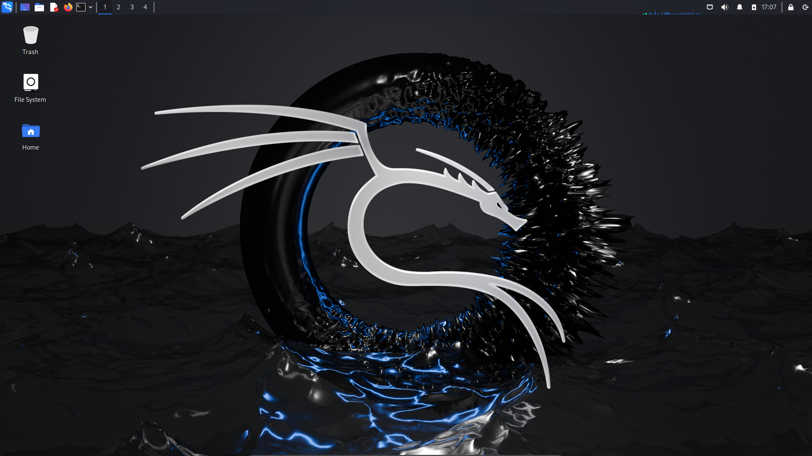
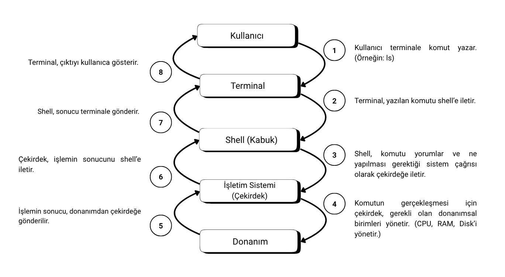
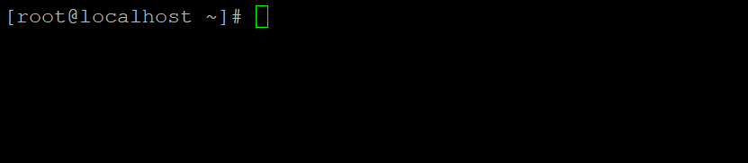

<!-- İçindekiler -->
# İçindekiler
- [Bilgisayarla İletişim Kurmak: GUI ve CLI](#bilgisayarla-i̇letişim-kurmak--gui-ve-cli)
	- [GUI (Grafik Kullanıcı Arayüzü)](#gui-grafik-kullanıcı-arayüzü) 
	- [CLI (Komut Satırı Arayüzü)](#cli-komut-satırı-arayüzü) 
- [GNU/Linux'ta GUI ve CLI](#gnulinuxta-gui-ve-cli)
- [Desktop Environment (Masaüstü Ortamı)](#desktop-environment-masaüstü-ortamı)
- [Terminal ve Shell (Kabuk)](#terminal-ve-shell-kabuk)
	- [Terminal](#terminal)
	- [Shell](#shell)
- [Terminal Ekranı](#terminal-ekranı)
- [Terminal Kısayolları](#terminal-kısayolları)

 

<!-- Bilgisayarla İletişim Kurmak : GUI ve CLI -->
# Bilgisayarla İletişim Kurmak : GUI ve CLI 

Bir bilgisayarı kullanmak, onun içerisindeki donanıma erişmek ve bu donanımı yönetmek anlamına gelir. İşte bu erişim ve yönetim, ***İşletim Sistemleri*** aracılığıyla mümkün olur. Yani, kullanıcılar işletim sistemiyle etkileşime girerek donanıma hükmeder.

> **İşletim Sistemi:** Kullanıcılar ile donanım arasında köprü görevi görür ve bilgisayar kaynaklarını yönetir.

Bilgisayarı kullanmamızı sağlayan işletim sistemleri, kullanıcı ve donanım etkileşimini sağlamak adına 2 farklı çözüm sunar : *GUI* ve *CLI*.

### GUI (Grafik Kullanıcı Arayüzü)

* Windows ve MacOS tarafında aşina olduğumuz fare ile etkileşim kurulan, pencereler, menüler, simgelerden oluşan görsel bir arayüzdür.
* Bu arayüz sezgisel bir deneyim sunduğundan dolayı kullanıcalara daha kolay gelmektedir.

### CLI (Komut Satırı Arayüzü)

* Herhangi bir grafiğin olmadığı, sadece metin tabanlı olarak komut girilerek bilgisayarla etkileşime girilen arayüzdür.
* Sezgisel olarak GUI gibi olmasa da GUI'den daha güçlü ve verimli bir kullanım sunar.

 

<table>
  <tr>
    <td align="center"><strong>GUI</strong></td>
    <td align="center"><strong>CLI</strong></td>
  </tr>
  <tr>
    <td>
      
    </td>
    <td>
      
    </td>
  </tr>
  <tr>
    <td align="center">
      Kali Linux 2024.3 - XFCE Desktop Environment 
    </td>
    <td align="center">
      Rocky Linux 8.10 - Bash Terminal
    </td>
  </tr>
</table>

 

<!-- GNU/Linux'ta GUI ve CLI -->
# GNU/Linux'ta GUI ve CLI

GNU/Linux, hem grafiksel arayüzün (GUI) rahatlığını hem de komut satırı arayüzünün (CLI) gücünü sunan esnek bir işletim sistemidir. Hedeflenen amaca ve kullanıcıları taleplerine göre hangi arayüzün kullanılacağı değişebilir. 

GUI'nin aksine CLI, Linux üzerindeki neredeyse her şeyin yapılmasına olanak tanır. GUI'de erişilemeyen veya daha karmaşık olan birçok ayar ve işlem, tek bir komutla yapılabilir. Sağladığı bu kontrol ve otomasyon yetenekleri, özellikle sunucu olarak kullanılan makinelerde veya sistem yönetimi görevlerinde CLI'ın vazgeçilmez olmasının temel sebebidir.

 

<!-- Desktop Environment (Masaüstü Ortamı) -->
# Desktop Environment (Masaüstü Ortamı)

Bilgisayarların görsel olarak kullanılması sağlayan GUI, karşımıza genellikle "Masaüstü Ortamı" şeklinde çıkar. 

Masaüstü ortamı, bir işletim sisteminde (Windows, MacOS, Linux) görsel olarak algılanan pencere yöneticisi, menüler ve simgeler gibi görsel öğelerin ve bu öğelerle etkileşime geçilmesini sağlayan araçların bütünüdür. Kısaca bilgisayar ekranında gözüken ve tıklanılan her şey bir masaüstü ortamının parçasıdır.

> Bir işletim sisteminde kullanıcıya GUI sağlayan yazılım paketlerinin bütünüdür.

Windows ve MacOS gibi sistemler tek bir masaüstü ortamı (kendi özel GUI'leri) sunarken; Linux, özgür yazılım olmasının bir sonucu olarak birden fazla masaüstü ortamı seçeneğini sunar. Bu durum, kullanıcılara diledikleri ve ihtiyaçlarına göre istediklerini kullanma hakkımı tanır.

Linux'un sunmuş olduğu masaüstü ortamlarından bazıları :
- GNOME
- KDE
- XFCE
- Cinnamon
- MATE
- ...

**NOT :** Eğer yukarıdaki masaüstü ortamlarından hiçbiri sizin zevkinize uymuyorsa, Linux'un açık kaynak yapısı sayesinde kendi masaüstü ortamınızı geliştirmeniz için önünüzde bir engel durmadığını hatırlarmak isterim :)

 

<!-- Terminal ve Shell (Kabuk) -->
# Terminal ve Shell (Kabuk)

Linux dünyasına adım atarken doğrudan komutlara odaklanmadan önce bu komutların yazıldığı yapıyı anlamak kritik öneme sahiptir. Tam da bu noktada karşımıza ***Terminal*** ve ***Shell*** kavramları çıkıyor.

### Terminal

Terminal, aslında CLI'yı kullanmak için etkileşime girilen pencere veya ekrana verilen addır. Moder Linux dağıtımlarında *"Terminal Emilatörü"* olarak da geçer. Yani komutların yazıldığı ve çıktıların gözüktüğü yerdir.

### Shell

Shell, kullanıcının komutlarını, yorumlanıp işletim sistemi (çekirdek) ile etkileşim kurmasını sağlayan yapıdır. Bir nevi kullanıcı ile işletim sistemi çekirdeği arasında tercümanlık vasıfesini yapar.

Kullanıcı tarafından belirtilen komutlar, GUI ve CLI üzerinden farklı şekillerde gerçekleştirildiğinden shell kavramı, 2 farklı biçimde karşımıza çıkar :

- Komut Kabuğu (Command Shell)
	* Terminalde üzerinden etkileşim kurulan ve metin tabanlı komutları yorumlayan Shell türüdür.

- Grafiksel Kabuk (Graphical Shell)
	* Daha önce bahsedilen [masaüstü ortamlarına](#desktop-environment-masaüstü-ortamı) denk gelir.
	* Fare tıklamaları, simge sürüklemeleri gibi grafiksel işlemleri yorumlar ve işletim sistemi ile etkileşime girer.

 

<!--  -->

 

> **NOT :** Shell kavramı haddizatında ister komut satırı isterse grafiksel arayüz olsun kullanıcının komutlarını yorumlayıp işletim sistemi ile etkileşime giren programa verilen addır. Ancak shell kavramı bu genel anlamından ziyade özel anlamı olan **Komut Kabuğu** yerine kullanılırken, grafiksel kabuk yerine de **Masaüstü Ortamı** kavramı kullanılmaktadır.  

Masaüstü ortamlarının farklı marka modelleri olduğu gibi Shell'in de marka ve modelleri bulunur. Linux tarafında karşımıza çıkan Shell çeşitleri :

- Bash : Çoğu dağıtımın varsayılan Shell'idir.
- Zsh : Bash'in daha gelişmiş halidir.
- Fish
- Tsch
- ...

 

<!-- Terminal Ekranı -->
# Terminal Ekranı

Linux'u komut satırı aracılığıyla kullanmak için, komutları doğrudan çalıştırmaya başlamadan önce etkileşim kurulan arayüzü, yani Terminal ekranını tanımak gerekir. Komutların yazıldığı ve sistem çıktılarının gözüktüğü bu ekran, Linux ile konuşulan yerdir.

Yukarıdaki görselde de gözükeceği üzere, Terminal ekranında bir **Komut İstemi (Prompt)** bulunur. Bu komut istemi bize bazı bilgiler sunar ve komut yazmamız için hazırdır.

> Komut istemi genellikle şu şekilde gözükür :
> - `[kullanici_adi@makine_adi mevcut_dizin]$`
> -  Örnek : `[root@localhost ~]#`

### `[root@localhost ~]#` komut isteminin parçaları :

- `root` **(Kullanıcı Adı)** : Bu kısım, terminalde oturum açmış kullanıcın adını gösterir. Buradaki örnekte root kullanıcısının oturum açmış olduğu anlaşılır.
- `localhost` **(Makina Adı)** : Bu kısım, üzerinde çalışılan bilgisayarın adını **(hostname)** gösterir.
- `~` **(Bulunduğu Dizin)** : 
	- Kullanıcın bulundğu, mevcut çalışma dizinini gösterir.
	- Buradaki `~` ifadesi, oturum açan kullanıcının ev dizini ifade eder. (root kullanıcısı için "/root" dizininde anlamına gelir.)
	- Eğer başka bir dizinde olsaydı o dizinin yolu gözükür. (Mesela, "/var/log")
- `#` (Yetki Sembolü) : Komut isteminin sonunda yer alan sembol, o anki kullanıcının yetkisini ifade eder.
	- `#` ifadesi : Yetkili kullanıcı ile oturum açıldığını ifade eder. Sisteme tam erişimi vardır.
	- `$` ifadesi : Standart bir kullanıcı ile oturum açıldığını ifade eder. Sisteme kısıtlı erişimi vardır.

> NOT : Komut isteminin de (Prompt) özelleştirilebileceğini hatırlatmak isterim. (İpucu : PS1 değişkeni)

 

<!-- Terminal Kısayolları -->
# Terminal Kısayolları

Terminal ekranınında kullanılan kısayollar :

- `Tab Tuşu` : Komutları, dosya isimlerini, dizin isimlerini otomatik olarak tamamlar.
- `Yukarı Ok` ve `Aşaği Ok` : Daha önce terminalde çalışılan komutlar arasında gezinmeyi sağlar.
- `CTRL + R` : Komut geçmişinde komut aramayı sağlar. (Reverse şekilde)
- `CTRL + C` : Çalışan bir komutu iptal eder, durdurur.
- `CTRL + D` : Terminal oturumunu sonlandırır. `exit` komutu ile aynı amaca hizmet eder.
- `CTRL + L` : Terminal ekranını temizler. `clear` komutu ile aynı amaca hizmet eder.
- `CTRL + A` : İmleci komutun başına götürür.
- `CTRL + E` : İmleci komutun sonuna götürür.
- `CTRL + K` : İmleçten satır sonuna kadar olan yeri siler.
- `CTRL + U` : İmleçten satır başına kadar olan yeri siler.
