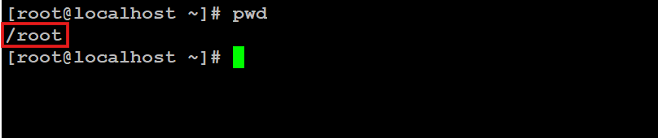
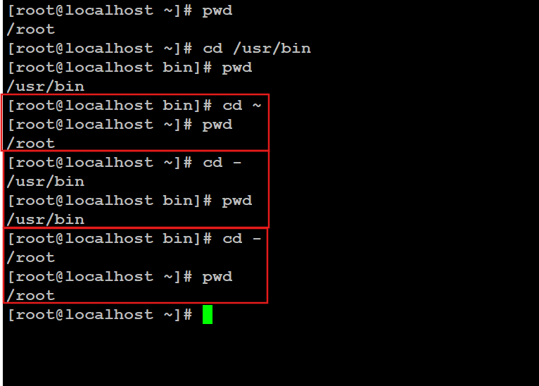
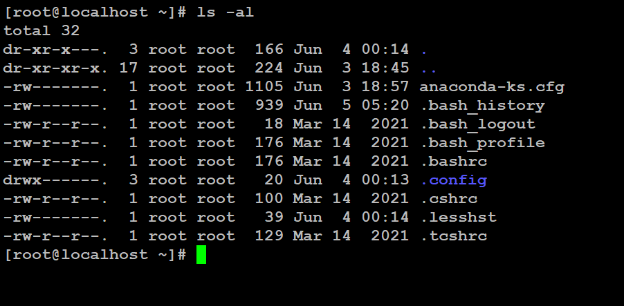

<!-- İçindekiler -->
# İçindekiler  

- [Giriş](#giriş)
- [Komutların genel Yapısı](#komutların-genel-yapısı)
- [Linux Dosya Sisteminde Konum Belirtme](#linux-dosya-sisteminde-konum-belirtme)
	- [Mutlak Yol (Absolute Paths)](#mutlak-yol-absolute-paths)
	- [Göreceli Yol (Relative Paths)](#göreceli-yol-relative-paths)
- [Linux'taki Temel Komutlar](#linuxtaki-temel-komutlar)
	- [Neredeyim ? - `pwd`](#neredeyim----pwd)
	- [Dizinler Arası Gezinme - `cd`](#dizinler-arası-gezinme---cd)
	- [Dizin İçeriğini Listeleme - `ls`](#dizin-i̇çeriğini-listeleme---ls)
	- [Komutlara Yardım Alma](#komutlara-yardım-alma)
		- [1. Man Sayfası - `man`](#1-man-sayfası---man)
		- [2. Yardım Parametresi - `--help`](#2-yardım-parametresi-----help)

<br>

<!-- Giriş -->
# Giriş  

GNU/Linux'un temel felsefesini, dizin yapısını, GUI ce CLI farkını, komut satırı arayüzünün (CLI) gücünü daha önceki konularda ele aldık. Artık Linux'un sağladığı bu gücü etkin bir şekilde kullanmaya başlama zamanı geldi. Bu yazıda, Linux'un etkin bir şekilde kulllanılmasını sağlayacak temel komutları ele aldık. 

<br>

<!-- Komutların Genel Yapısı -->
# Komutların Genel Yapısı

Linux'u, CLI ekranı üzerinden kullanmamıza olanak sağlayan komutlara geçmeden önce komutların genel yapısını ve çalışma prensibini anlamak gerekir.

Bir komut genelde üç ana bölümden oluşur : *komutun kendisi*, *seçenekler(options/flags)* ve *argümanlar(arguments)*  

```bash
komut [seçenekler] [argümanlar]
```

* **Komut (Command) :** Çalıştırılmak istenen programı veya uygulamayı çalıştıran ifadedir.
* **Seçenekler (Options/Flags) :** Komutun davranışını, çalışma biçimini değiştiren, belirli bir özelliğini etkinleştiren veya devre dışı bırakan parametrelerdir.
	* Tek bir tire ile (`-`) kısa formda ifade edilebilir.
	* Çift tireyle de (`--`) uzun formatta ifade edilebilir.
* **Argümanlar (Arguments) :** Komutun üzerinde işlem yapacağı hedef veya verilerdir. Bunlar, bir dosya adı, bir dizin yolu, bir kullanıcı adı ya da her hangi bir veri olabilir.

**Örnek :**
```bash
ls -l /home/josef/documents
```
- `ls` : komut
- `-l` : opsiyon
- `/home/josef/documents` : Argüman (komutun üzerinde çalışacağı yol)

<br>

<!-- Linux Dosya Sisteminde Konum Belirtme -->
# Linux Dosya Sisteminde Konum Belirtme

Linux dosya sisteminde herhangi bir dosyanın veya dizinin belirtilmesinin iki yolu vardır : *Mutlak Yol (Absolute Paths)* ve *Göreceli Yol (Relative Paths)*.

### Mutlak Yol (Absolute Paths)

* Bir dosyanın veya dizinin kök dizinden (`/`) başlayarak tam konumunu ifade eder. 
* Komutun nereden çalıştırıldığının bir önemi yoktur. Çünkü mutlak yol her zaman aynı hedefi göstermektedir.
* `/home/stalin/Downloads` : Stalin adlı kullanıcının Downloads dizini.

### Göreceli Yol (Relative Paths)

* Bir dosya veya dizinin, mevcut konumunuzdan itibaren nerede olduğunu ifade ediş biçiminizdir.
* Yani ifade edeceğiniz hedef yol, bulduğun konuma göre değişir.
* Göreceli ifadeler :
	- `.` : Mevcut çalışma dizinini ifade eder.
	- `..` : Mevcut çalışma dizininin bir üst dizinini ifade eder.
	- `~` : Mevcut kullanıcının ev dizinini (home directory) ifade eder.
* `/home/kruscev/` dizininde olduğunuzu varsayarsak :
	- `belgeler` : `/home/kruscev/belgeler` dizinini ifade eder.
	- `../mustafa/resimler` : `/home/mustafa/resimler` dizinini ifade eder.  

<br>

<!-- Linux'taki Temel Komutlar -->
# Linux'taki Temel Komutlar

<!-- `pwd` -->
# Linux'taki Temel Komutlar

`pwd` komutu, Linux kullanıcısının nerede olduğunu, mevcut konumunu belirtir.

> `pwd` = "Print Working Directory"

<br>

**Örnek :**


	
- Yukarıdaki görselde `pwd` komutu ve çıktısı gözükmektedir. 
- Bu çıktıya göre kullanıcının, `/root` dizinde olduğu anlaşılır.

<br>

## Dizinler Arası Gezinme - `cd`

`cd` komutu ile kullanıcı, bulunduğu dizini, mevcut konumunu değiştirebilir.

> `cd` = "Change Directory"

<!-- `cd` -->
### `cd` Komutu Kullanımı :

```bash
# Genel Kullanım
cd [Hedef/Yol/...]

# Örnek Kullanım (Mutlak Yol)
cd /usr/bin
cd /var/spool/mail

# Örnek Kullanım (Göreceli Yol)
cd ../resimler
cd belgeler

# Özel Kullanım
cd ..	# Bir üst dizine gider
cd ~	# Kullanıcının ev dizinine gider
cd -	# Kullanıcının bulunduğu bir önceki dizine gider
```

<br>

**Örnek :** 



1. Kullanıcının `/root` dizininden `/usr/bin` dizinine gittiğini görüyoruz.
2. `cd ~` komutu ile kullanıcının ev dizinine `/root` gittiğini görüyoruz. 
3. `cd -` komutu ile kullanıcının bir önceki bulunduğu dizine gittiğini görüyoruz `/usr/bin`.
4. `cd -` komutu ile kullanıcının bir önceki bulunduğu dizine gittiğini görüyoruz `/root`.

<br>

<!-- `ls` -->
## Dizin İçeriğini Listeleme - `ls`

`ls` komutu, dizin içeriği listelemeye yarar. Bir Linux sistemindeki en sık kullanılan komut işte budur.

```bash
# Mevcut konumu listeler
ls

# Belirtilen hedef içeriğini listeler
ls [Hedef/Yol/...]

### Örnek : ###
# Kök dizini listeler
ls / 	
# "home" altındaki "kulanici" adlı kullanıcının "belgeler" dizini. 
ls /home/kullanici/belgeler  
```

`ls` komutunun parametreleri :

* `-l` : Dizin içeriğini detaylı ve uzun formatta listeler
	- Listelediğini özellikler : İzinler, bağlantı sayısı, sahip, grup, boyut, son değiştirme tarihi, dosya/dizin adı şeklinde pek çok meta datanın çıktısını verir.
* `-a` (all) : Gizli dosyaları da listeler. (`.` ile başlayan)
* `-h` (human-readable) : Boyutları, insanın okuyabileceği formatta gösterir. (KB, MB, GB)
* `-R` (Recursive) : Öz yinelemeli olarak bulunuduğu dizin ve altındakileri dizinleri listeler.
* `-F` : Dizinleri (`/`) ile, çalıştırılabilir dosyaları (`*`) ile, sembolik bağlantıları (`@`) ile ve diğer dosya türlerini belirli semboller ile işaretler.

**Örnekler :**

```bash
# Parametrelerin birlikte kullanımı (birleşik bir şekilde)
ls -al
```

```bash
# Parametrelerin birlikte kullanımı (ayrı bir şekilde)
ls -a -l 
```

```bash
# Parametreli ve Argümanlı kullanımı
ls -alh /home
```

<br>



<br>

<!-- Komutlara Yardım Alma -->
## Komutlara Yardım Alma

Linux komut satırında çalışırken, bir komutun tam olarak ne işe yaradığını, hangi seçeneklere sahip olduğunu veya nasıl kullanıldığını hatırlayamamak oldukça doğaldır. Bu noktada Linux, bize yardımcı olacak araçlar sunmaktadır.

Komutlar hakkında bilgi edinmenin yolları :

<!-- `man` -->
### 1. Man Sayfası - `man`

`man` komutu, Linux'taki çoğu komut için kılavuz sayfalarına (manual pages) erişilmesini sağlar.

Kullanımı :

```bash
man [komut_adi]
```

Örnek :

```bash
man ls
```
* Bu komut çalıştırıldığında komutun man sayfası açılacaktır.
* Komutun genel kullanımı, açıklaması, parametreler ve ne işe yaradıkları, örnekler ve ilgili diğer komutlardan bahseder.

### Man Sayfasında Gezinme

Man sayfası genellikle ayrı bir sayfada açılır. bu sayfa içerisinde gezinmek için kullanılan tuşlar :
* `Boşluk tuşu` : Bir sayfa aşağı kaydırır.
* `b` : Bir sayfa yukarı kaydırır.
* `Yukarı/Aşağı Ok Tuşları`: Satır satır ilerlemenizi sağlar.
* `q` : Man sayfasından çıkar.

<!-- `--help` -->
### 2. Yardım Parametresi - `--help`

Çoğu linux komutu hızlı ve özet bilgi sunmak için stndart `--help` parametresini kullanır. Man sayfası kadar detaylı olmasa da hızlı ve pratik bilgi edinmek için kullanılır.

Kullanımı :
```bash
[Komut_adi] --help
```

Örnek :
```bash
ls --help
```
