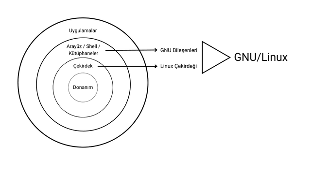

<!-- 

Eklenecekler :
	* Linux vs Unix
	
 -->

<!-- İçindekiler -->
# İçindekiler
- [Giriş](#giriş)
- [Özgür Yazılım Hareketi](#özgür-yazılım-hareketi)
- [GNU (GNU is Not Unix)](#gnu-gnu-is-not-unix)
- [Linux](#linux)
- [GNU/Linux](#gnulinux)
- [FSF (Free Software Foundation)](#fsf-free-software-foundation)
- [GPL (General Public License)](#gpl-general-public-license)
- [Sonuç](#sonuç)

 

<!-- Giriş -->
# Giriş
Yazılımlar, modern dünyada sadece bilgisayarları değil; iletişimi, üretimi, eğitimi ve hatta toplumun işleyişini de yönlendiren temel bileşenler haline gelmiştir. Ancak bu teknolojik ilerleme, yazılımların kimin kontrolünde olduğu sorusunu da beraberinde getirmiştir. Kullanıcıların yazılım üzerinde ne ölçüde söz hakkına sahip olduğu, sadece teknik değil, aynı zamanda etik bir meseledir.

İşte bu noktada özgür yazılım kavramı, yalnızca bir yazılım geliştirme modeli değil, bir hak ve özgürlük hareketi olarak öne çıkar. Bu belge, özgür yazılımın arkasındaki düşünce yapısını, bu düşüncenin hayata geçirilme sürecini ve bunun somut bir örneği olan GNU/Linux sistemini ve bununla alakalı kavramları açıklamaya çalışmaktayım.

 

<!-- Özgür Yazılım Hareketi -->
# Özgür Yazılım Hareketi
1980'li yılların başında, yazılım dünyasının gelişmesiyle birlikte geliştirilen yazılımlar üzerinde ticari amaç güdüsü artmaya başlamıştı. Bu dönemde geliştirilen yazılımlar **"Özel Yazılım"** modeline dayanıyordu. Özel yazılımların kaynak kodlar gizli ve sadece lisanslı kullanıcılar o yazılımı kullanabiliyordu. Bu durum yazılım geliştirme ve kullanma özgürlüğünü tehdit eden bir unsur haline gelmeye başlamıştı.  

Bu tehdit unsurunu görenlerden biri olan Richard Stallman, çalıştığı yer olan MIT'den ayrılarak **"Free Software Movement" (Özgür Yazılım Hareketi)** adı verilen ve kullanıcıların yazılım üzerinde kontrol sahibi olmasını sağlayan, altında dört temel özgürlüğün yattığı bir hareket başlattı.

### Dört Temel Özgürlük :
0.	Yazılımı herhangi bir amaçla çalıştırma özgürlüğü
1.	Kaynak koda erişip onu değiştirme özgürlüğü
2.	Yazılımın kopyalarını paylaşma özgürlüğü
3.	Değiştirilmiş sürümleri başkalarıyla paylaşma özgürlüğü.

 

> "Özgür yazılım, 'bedava' demek değildir. Kullanıcıyı özgür kılan yazılım demektir."

 

<!-- GNU (GNU is Not Unix) -->
# GNU (GNU is Not Unix)
Stallman, bir bilgisayarı kullanmak için ihtiyaç duyulan tüm yazılımların kullanıcıların tam denetiminde olmasını ve her hangi bir kısıtlama içermememsi gerektiğini düşünüyordu. Bir bilgisayarın özgürce kullanılması için kulllanılan işletim sisteminin özgür olması gerekliydi. 

Bu düşüncenin bir zühuru olarak Stallman, tamamen özgür bir işletim sistemi geliştirmeye karar verdi. İşte geliştirilmeye başlanılan bu projenin adı da **GNU**'dur. Tamamen özgür bir işletim sistemi.

Aynı zamanda **GNU** bu kapsamda geliştirilen yazılım ve araçların tümünü temsil eder.

 

<!-- Linux -->
# Linux
1991 yılında, Finlandiya'lı Linus Torvalds tarafından özgür yazılım olarak geliştirilen bir işletim sistemi çekirdeğidir.

 

<!-- GNU/Linux -->
# GNU/Linux
1991 yılına gelindiğinde GNU peojesi kapsamında özgür işletim sistemi için pek çok yazılım ve araç geliştrilmişti ancak bir işletim sisteminin çalışabilmesi için gerekli bileşenlerden biri olan çekirdek (karnel), uzun süredir geliştirilmekteydi ama hala tamamlanamamıştı.

1992 yılında Linus tarafından geliştirilen özgür Linux çekirdeği ise bir işletim sisteminin çalışabilmesi için gerek sadece çekirdek kısmını içeriyiordu.

Her iki proje de eksikti ve hala çalışan bir işletim sistemi sunamamaktaydı. Bu iki proje kendi başlarına eksik olmalarının yanı sıra birbirlerinin eksikliklerini ancak birlikte kapatabileceklerdi. İşte bu noktada **Linux çekirdeği** ve **GNU araçlarının** bir araya gelmesiyle oluşturulan işletim sistemlerinin genel adı **"GNU/Linux"**tur. Bu kapsamda geliştirilen işletim sistemlerinin tümüne de **"GNU/Linux Dağıtımı"** denilmektedir.

 

 

> **NOT** : Bu doğrultuda geliştirilen işletim sistemlerinin adı **"GNU/Linux"** olmasının yanı sıra zamanla kolay söylenmesi sebebiyle tüm bu dağıtımlara **"Linux"** denmeye başlanmıştır.

 

<!-- FSF (Free Software Foundation) -->
# FSF (Free Software Foundation)
Özgür Yazılım Vakvı (FSF), Stallman'ın ortaya attığı özgür yazılım hareketini kurumsallaştırmak adına 1985 yılında kurduğu vakfıdr.

 

<!-- GPL (General Public License) -->
# GPL (General Public License)
FSF tarafından geliştirilen ve sunulan, özgür yazılımları korumak adına kullanılan bir lisanstır.  

 

<!-- Sonuç -->
# Sonuç
Özgür yazılım, yalnızca bir teknoloji değil, insanlığın dijital özgürlüğünü savunan bir direniştir. Bu hareket, teknolojiyi bir araç olmaktan çıkarıp, herkesin eşit haklara sahip olduğu bir dünyayı kurma amacını taşır. GNU ve Linux, bu devrimin simgeleridir.