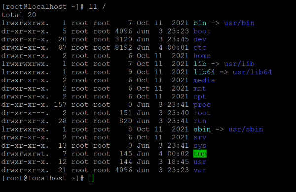

<!-- İçindekiler -->
# İçindekiler
- [Giriş](#giriş)
- [Dizin Hiyerarşisi](#dizin-hiyerarşisi)
	- [/](#-rootkök-dizin)
	- [/bin](#bin)
	- [/boot](#boot)
	- [/dev](#dev)
	- [/etc](#etc)
	- [/home](#home)
	- [/lib](#lib)
	- [/media ve /mnt](#media-ve-mnt)
	- [/opt](#opt)
	- [/proc](#proc)
	- [/root](#root)
	- [/run](#run)
	- [/sbin](#sbin)
	- [/srv](#srv)
	- [/sys](#sys)
	- [/tmp](#tmp)
	- [/usr](#usr)
	- [/var](#var)
- [Ayrıca Bakınız](#ayrıca-bakınız)

 

<!-- Giriş -->
# Giriş
GNU/Linux işletim sistemlerinde kullanılan dosya sistemi yapısı, Windows gibi diğer sistemlerden oldukça farklıdır. Linux'ta her şey bir dosyadır ve tüm dosyalar, kök dizin (/) altında birleşen tekil bir hiyerarşik ağaç yapısı içinde düzenlenir.

Linux sistemlerinde kullanılan bu dosya sistemi, **FHS (FileSystem Hierarchy Standard)** adı verilen bir standart doğrultusunda hiyerarşik bir yapıya sahiptir. Bu standart sayesinde farklı Linux dağıtımları ve yazılımlar, uyumlu ve öngörülebilir bir dizin yapısında çalışmaktadır.

Bu hiyerarşik yapıdaki her bir dizin, belli başlı bir göreve ve sorumluluğa sahiptir. Açık kaynak ve özgür yazılım felsefesi doğrultusunda bu hiyerarşik dizin yapısı düzenlenebilir, değiştirilebilir, esnetilebilir, yeniden yapılandırılabilir. Ancak standartlara uygunluk, diğer araçlar ve kullanıcılar ile uyum içerisinde olunmasını sağlar. 

> Linux'ta her şey bir dosyadır.

 

<!-- Linux Dizin Hiyerarşisi  -->
# Dizin Hiyerarşisi

### / (Root/Kök Dizin)
- Tüm dosya sisteminin hiyerarşisinin başlangıç noktasıdır.
- Tüm dosyalar, dizinler, diskler vb. her şey bu dizinin altındadır.
- Besin zincirinin en tepesindeki yer.

### /bin 
- Sistemdeki temel işlevlerin yerine getirilebilmesi için kullanılan komutları barındığı yer.
- Normal kullanıcılar tarafından çalıştırılan, yetki gerekmeyen komutlar.
- ls, cp, mv vb. komutlar.

### /boot
- Sistemin açılış/başlangıç sürecinde ihtiyaç duyduğu önyükleme dosyalarının barındığı yerdir.
- Bilgisayar açıldığında ilk buradaki dosyalar devreye girer.

### /dev 
- İşletim sisteminin fiziksel veya sanal aygıtları dosya olarak temsil ettiği yerdir
- USB, sabit disk, RAM, CPU, klavye, seri portlar, CD gibi aygıtlara erişebilebilen aygıt dosyalarının bulunduğu yerdir.

### /etc
- Sistem genelinde geçerli olan yapılandırma-konfigürasyon dosyalarının bulunduğu yerdir. 
- DNS ayarları, IP ayarları vs.

### /home
- Kullanıcıların barındığı yerdir.
- her kullanıcının kendi adında bir alt klasörü olur. (/home/abdullah)

### /lib
- Paylaşılan kütüphaneler ve çekirdek modülleri burada bulunur
- Paylaşılan Kütüphaneler, sistemdeki araçların ortak olarak kullandığı kütüphaneler anlamına gelir. Kütüphanelerin ortak kullanılabilcek alanda tutulması aynı kütüphaneyi kullanan araçlar için gereken kütüphanelerin tekrar edilmesini önleneyerek bellek israfını önler. 
- Buradaki kütüphaneler /bin ve /sbin'deki komutların çalıştırılması için elzemdir.
- Kütüphane dosyaları genellikle .so ile biten dosyalardır. Windowstaki .dll dosyalarına benzetilebilir.
- Çekridek modülleri "lib/modules/" altında bulunur.
- Araçlar için uyumluluk adına lib64 ve lib32 adlarında dizinler de bulunabilir.

### /media ve /mnt
/media : 
- Genellikle grafik arayüz (GUI) bulunan masaüstü sistemlerde, harici depolama aygıtlarının otomatik olarak bağlandığı (mount edildiği) dizindir. 
- Bir USB bellek, harici disk veya SD kart taktığında, sistem buraya otomatik olarak bir klasör oluşturur ve aygıtın içeriğini oraya bağlar.
- "/media/kullanici_adi/aygıt_adı" şeklinde gözükür.

/mnt : 
- Diskin elle bağlanmak istenildiğinde geçici olarak kullanılan dizindir.
- Buraya aygıtın bağlanması (mount) isteğe bağlıdır, zorunluluk değildir. 	

> Linux'ta harici bir depolama aygıtının Linux tarafından gözükebilmesi için gereken 2 işlem vardır :
> - **Takmak :**
> 	- Aygıtın fiziksel bilgisayarın portuna takılması. Fiziksel veya sanal olarak.
>	- Örbek olarak takılı aygıt : "/dev/sda1" (Takılan aygıtın Linux tarafından atanan cihaz dosyası adı)
> - **Bağlamak (Mount Etmek) :** 
> 	- Takılı olan aygıtın Linux dosya sisteminde bir klasöre bağlanarak erişilebilir hale gelmesi işlemidir. 
> 	- Klasör önceden var olmalıdır ve boş olmalısı beklenir.
> 	- Bu işlem otomatik ya da elle olabilir.
>	- Elle bağlama : "mount /dev/sdb1 /mnt"

### /opt
- Genellikle üçüncü parti veya bağımsız yazılımların yüklendiği yerdir.
- Uygulamaları buraya yüklemek tercihe kalmıştır. Adı üstünde "optional".
- Genel kullanım, paket yöneticisi dışında bir yöntemle kurulan uygulamaların buraya kurulmasıdır.

### /proc 
- İşlemci, bellek, bağlı aygıtlar, süreçler vb. sistem hakkında kullanıcıya anlık bilgi sağlayan, fiziksel diskte yer kaplamayan sanal dosyların bulunduğu bir dizindir.
- Burada fiziksel olarak veriler depolanmaz. Dinamik bir şekilde depolanır. Kalıcı değildir. Anlık olarak değişebilir. 

### /root
- Linux sisteminde her türlü yetkiyle kuşatılmış olan "root" kullanıcısının ev dizinidir.
- Diğer kullanıcılar /home altında bulunurken root kullanıcısı izole bir ortamda bulunur.
- Süper yetkili kullanıcının sarayı.

### /run 
- Linux'ta çalışan programlar ve servisler arasındaki iletişimi sağlayan ve sistemin anlık durumuna dair geçici dosyaları barındırır.
- Bu dosyalar genellikle süreç kimlik numaralarını (PID), soketleri ve kilit (lock) dosyalarını içerir.
- Genellikle RAM tabanlı (sanal bir dosya sistemi) olduğu için çok hızlıdır. Sistem yeniden başlatıldığında içeriği otomatik olarak sıfırlanır.

> **PID :** Linux'ta çalışan her sürece (process) atanan benzersin kimlik numarası

> **SOKET :** Programların birbirleriyle veri alışverişi yapmasını sağlayan iletişim uç noktalarıdır. (Aynı bilgisayarda veya ağ üzerinden)

> **LOCK :** Birden fazla sürecin veri bozulmasını önlemek adına aynı kaynağa eş zamanlı erişimini düzenleyen yapıdır.

### /sbin 
- Sistemin yönetimi için kullanılan ve yönetici yetkisi (root) gerektiren komutları barındığı yer.
- ifconfig, reboot, systemctl vb. komutlar.

### /srv 
- Sistemdeki çalışan servislere ait verilerin barındığı yerdir.
- Genellikle sunucu olarak çalışan Linux sistemlerinin dışarıya sunduğu hizmetlere dair verileri barındırır.
- Web sunucusu, FTP sunucusu gibi.

### /sys 
- Linux çekirdeğini ve donanım hakkında bilgi sağlayan sanal dosya sistemidir.
- Fiziksel diskte yer kaplamaz. RAM'den çalışır.
- /proc dizinine benzer şekilde sistem bileşenlerine dair bilgi sunar.

### /usr
- Kullanıcıların ve sistemdeki uygulamaların kullandığı kaynakları barındırır. 
- Linux dağıtımının temel programları, kütüphaneler, belgelerin barındığı yerdir.
- /lib, /bin ve /sbin  klasörleri aslında burada barınır. Root'un altında görüdüğümüz bu dizinleri, aslında /usr altındaki dizinleri işaret eden kısa yollar gibi düşünebiliriz. (/usr/bin, /usr/sbin, /usr/lib...)

### /var
- Değişken/Dinamik verilerin barındığı yerdir.
- Loglar, e-posta, cache ve yazıcı kuyruğu gibi dosyalar burada barınır.

### /tmp
- Geçi olarak dosyların saklandığı, oluşturulduğu yerdir.
- Bazı programlar burayı geçici olarak kullanabilir. Bilmediğniz dosyalar varsa pek dokunulması tavsiye edilmez.
- Tüm kullanıcıların buraya erişim yetkisi vardır.
- Sistem yeniden başladıltığında buradaki dosyalar otomatik olarak silinir.
- Yarıda kesilen işlemlerin kayıtları da burada bulunabilir.

 

# Ayrıca Bakınız

FHS (Filesystem Hierarchy Standard) Resmi Sitesi
- https://refspecs.linuxfoundation.org/FHS_3.0/fhs/index.html

Dizin Hiyerarşisine Farklı Bakış İçin
- https://wiki.gentoo.org/wiki/Filesystem_Hierarchy_Standard
- https://wiki.ubuntu-tr.net/index.php?title=Linux_dosya_sistemi_hiyerar%C5%9Fisi
- https://www.linuxdersleri.net/egitim/temel-linux/dizinlerde-gezinmek/#lib

